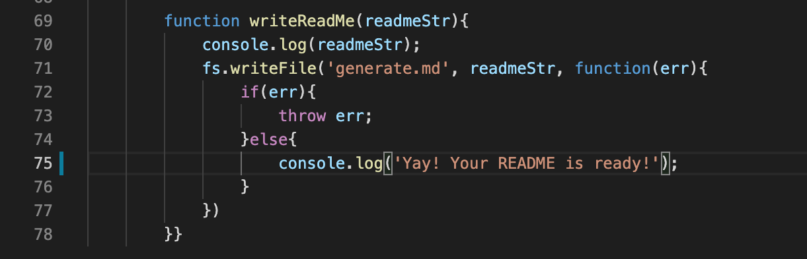

# README-generator

## Description 

This application will quickly generate a high-quality README.md file for a project based on user input. It heavily uses JavaScript and Node.js.

## Installation

In order to have access to this application, navigate to the clone button on this repository through GitHub. Clone the repository to the local machine.

## Usage

In order to use this application, you will want to run the command 'node index.js' once access to the repository is made through the command line on the local machine. The command line will then prompt the user for input through a series of questions which must be answered. Once all the data is collected a 'generate.md' file will be generated.

## Instructional Video on How to Use Application

https://watch.screencastify.com/v/M7M12EhTCRVz7T9qDKe1

## Mentionable Features

This was my first time utilizing Node.JS an the inquirer package. Having access to inquirer made things much more simplistic and cleaner in regards to syntax and execution. The utilization of 'fs' to write the .md file was also very useful and it made the whole application seem like magic! 

The image above shows the function that utilized the 'fs' package provided by npm that made writing the generate.md file possible and simplistic.
## Contact Me

For any questions on how the application was created or how it should be used, please contact me!

GitHub: https://github.com/mayaimorales

LinkedIn: https://www.linkedin.com/in/maya-morales-1191351bb/